# Particle-Vector-Art

Generative vector artwork in [Node.js](https://nodejs.org/en/) with [Paper.js](http://paperjs.org) using a particle simulation.

## Example Output

<p align="center">
    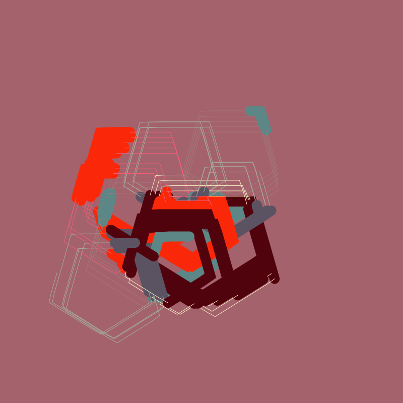
    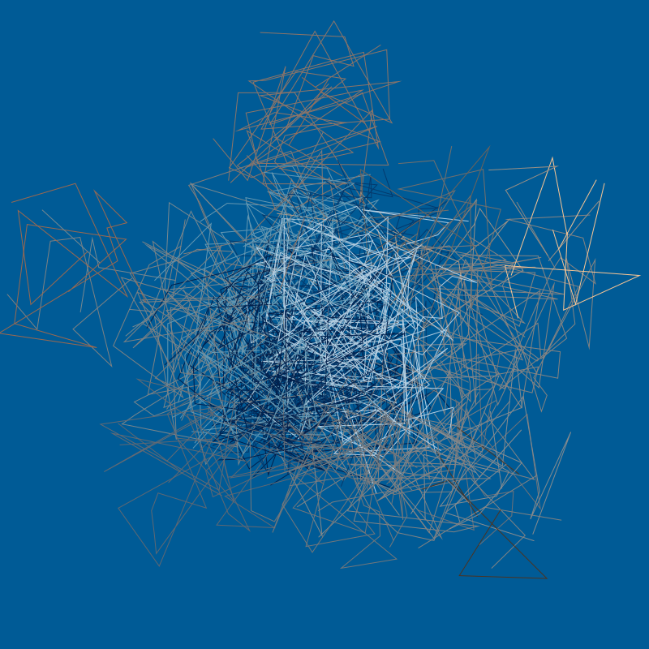
    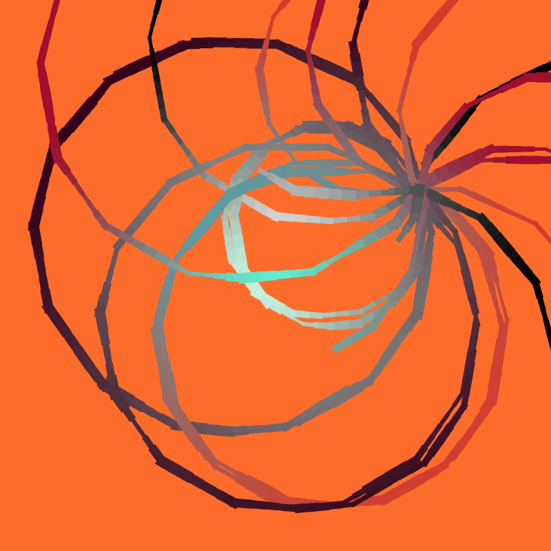
    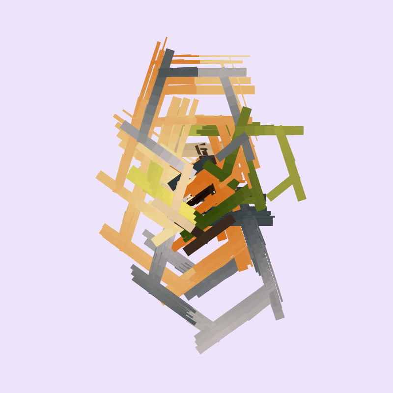
    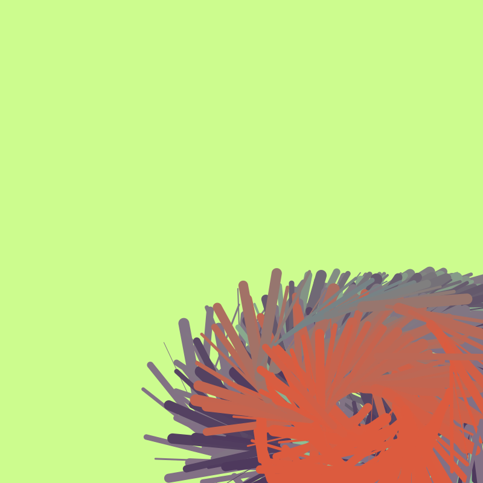
    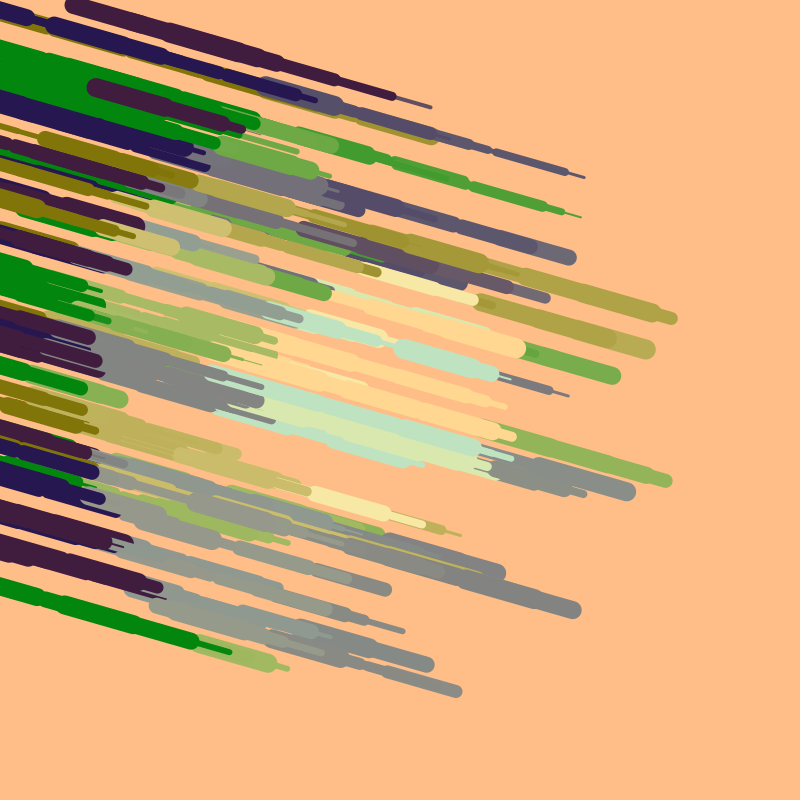
    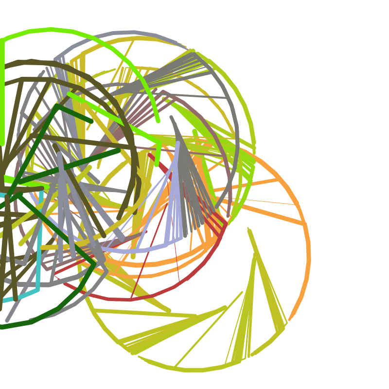
    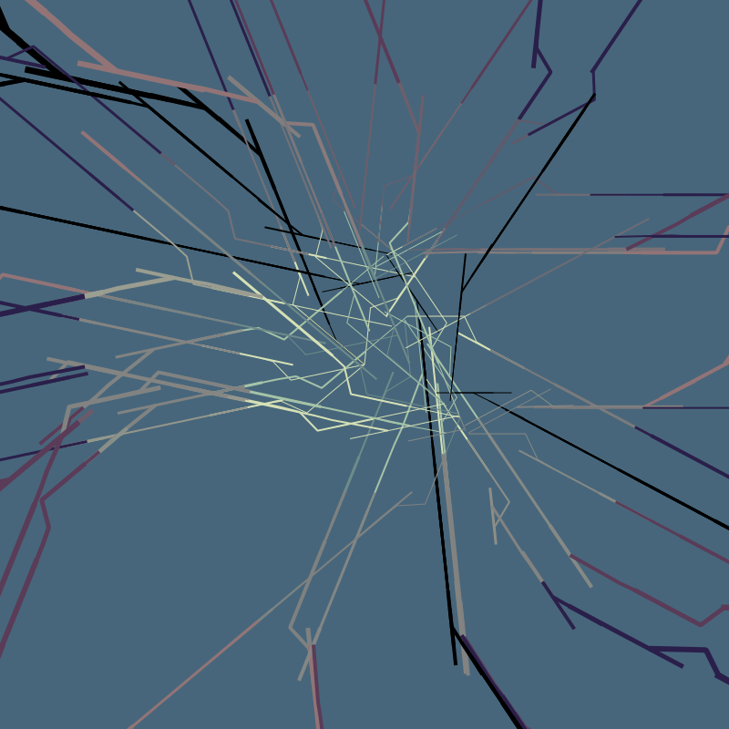
    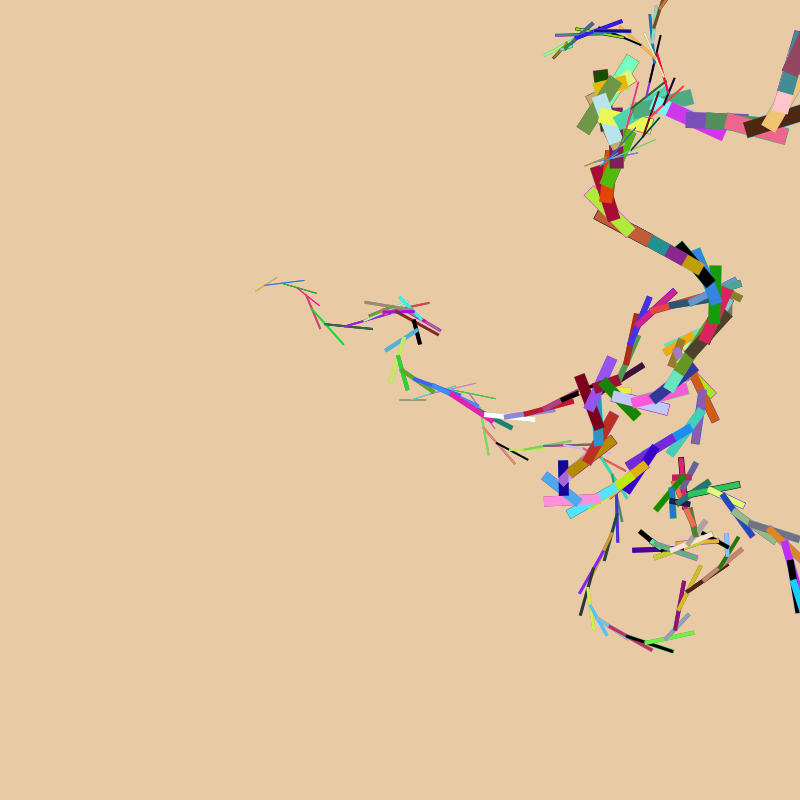
    
    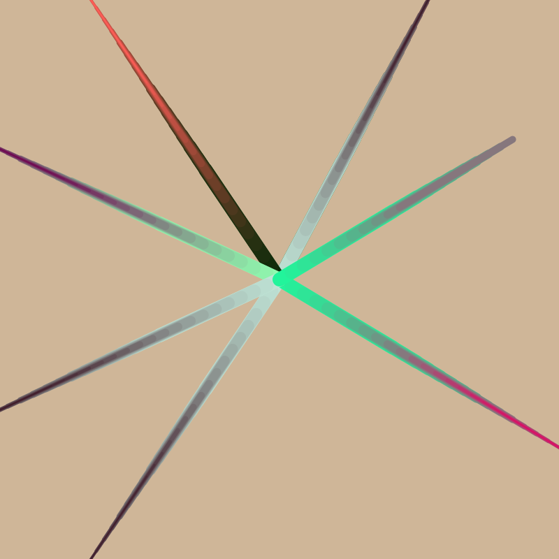
    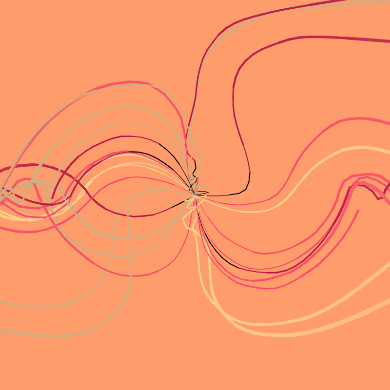
</p>

## Live Demo

[particle-vector-art.stuffjackmakes.com](https://particle-vector-art.stuffjackmakes.com) has a running demo of the web interface. This interface was developed as a visual aid in finding interesting run property configurations to use in the (quicker) Node.js application, and as such the UI is minimal.

## Usage

Clone the repository to your local machine and install the required libraries with:

```sh
npm install
```

Then run the program with the provided [run-properties.json](run-properties.json) and [heightmap.png](heightmaps/heightmap.png) with:

```sh
node index.js
```

And the output image(s) will be saved to the `output` folder, along with corresponding json metadata files in the `output/metadata` folder. Both folders are generated at runtime.

### Custom Heightmaps

To use different heightmaps, move the desired images to the [heightmaps](heightmaps) folder. The program detects all images in that folder and runs a simulation against each, repeating as defined in the run properties.

### Custom Run Properties

To use different run properties, edit [run-properties.json](run-properties.json) and run the program. All possible run property values are described in the Run Properties Format section below.

### In The Browser

Everything required to run this in the browser is included in the [public]() folder. To host the contents of that folder, run:

```sh
cd public/
npx http-server
```

Then go to `http://localhost:8080` in your web browser.

### Building

To bundle the code using [Browserify](http://browserify.org) and copy [run-properties.json](run-properties.json) to the [public](public) folder, run:

```sh
npm run web
```

## Run Properties Format

The [run-properties.json](run-properties.json) file controls the parameters of the simulation. All values are optional and revert to their default value if none is provided. The [run-properties-all.json](run-properties-all.json) contains all possible options as an example for how each is set.

- `repeatTimes`: How many additional times to generate an image for each heightmap. Note that this value does nothing in the browser. Default value is 0.
- `width`: Width of the generated image. Does not need to be related to the heightmap dimensions, and is itself dimensionless since the generated image is a vector. Default value is the width of the provided heightmap.
- `height`: Width of the generated image. Does not need to be related to the heightmap dimensions, and is itself dimensionless since the generated image is a vector. Default value is the width of the provided heightmap.
- `numParticles`: How many particles to simulate. Default value is a random integer between 1 and 8.
- `totalSteps`: How many times the simulation will last. Default value is a random integer between 100 and 500.
- `allowBackgroundColor`: if `true` then particles can be the same color as the background. Default value is randomly 50% true and 50% false.
- `palette`: A list of the colors to choose from, as hex strings (e.x. *["#F9A799", "#B7CBBF"]*). If missing, a random palette from [code/color-palettes.json](code/color-palettes.json) will be chosen, or if `random.brandNewPaletteChance` is non-zero, a completely random palette could be generated.
- `backgroundColor`: The color to be drawn as the background, as a hex string (e.x. *"#F9A799"*). If missing, a random color from the palette will be chosen.

#### `random`

- `random.nudgePropertiesChance`: The chance (0.0 to 1.0) to modify each of the run property values (this will not modify the original file). Useful for generating lookalike permutations. Default value is 0.
- `random.nudgePropertiesMagnitude`: The amount (0.0 to 1.0) to modify 'nudged' run property values. 1.0 indicates that the property could be anywhere from zero to double its initial value. Default value is 0.2.
- `random.brandNewPaletteChance`: The chance (0.0 to 1.0) that an undefined palette is made up of completely random colors versus using a palette from the [code/color-palettes.json](code/color-palettes.json) file. Default value is 0.

#### `utilityProperties`

- `utilityProperties.noiseType`: The type of noise used in randomization functions as enumerated in [code/constants.js](code/constants.js). Default value is 0 for simplex noise.
- `utilityProperties.easingFunction`: The easing functions used when transitioning between control functions over time. See [code/utilities.js](code/utilities.js) for enumeration and [easings.net](https://easings.net) for details. Default value is 0 for linear easing.
- `utilityProperties.xNoiseScale`: How noise output should be scaled along the X axis. A range of roughly `0.0025` to `0.1` works well, depending on preference for smooth or quick transitions in the noise field. This should also be sized in relation to `width`. Default value is 0.015.
- `utilityProperties.yNoiseScale`: How noise output should be scaled along the Y axis. A range of roughly `0.0025` to `0.1` works well, depending on preference for smooth or quick transitions in the noise field. This should also be sized in relation to `height`. Default value is 0.015.
- `utilityProperties.noiseTimeScale`: How noise output should be scaled as the simulation progresses. A low value (e.x. `0.0001` means that the noise field doesn't change much over the course of the iteration. A high value (e.x. `0.1`) means that the noise field changes more quickly.  Default value is 0.001.
- `utilityProperties.noiseFieldScale`: The factor by which to 'chunk' out noise values, lowering the variance for nearby 'chunks' while increasing it for adjacent 'chunks'. A value of `50` means that the noise field is split into a grid of 50x50 (dimensionless) squares, where the noise value in each square will always be the same value. A value of `1` means that this field has no effect. Default value is 1.
- `utilityProperties.seed`: A seed for the Simplex and Brownian noise functions. Note that this does not indicate reproducability, as Javascript's built-in `Math.random()` does not accept a seed input. Default value is `Date.now()`.

#### `particleDefaults`

- `particleDefaults.minSize`: The minimum size a particle can be. This should be sized in relation to `width`. Default value is 1.
- `particleDefaults.maxSize`: The maximun size a particle can be. This should be sized in relation to `height`. Default value is `Math.sqrt(width * height) / 32`.
- `particleDefaults.minLifespan`: The minimum number of iterations a particle operates for before it is replaced. This should be sized in relation to `totalSteps`. Default value is `totalSteps / 100`.
- `particleDefaults.maxLifespan`: The maximum number of iterations a particle operates for before it is replaced. This should be sized in relation to `totalSteps`. Default value is `totalSteps / 2`.
- `particleDefaults.minSpeed`: The minimum distance a particle must move in a single iteration. This should be sized in relation to `width` and `height`. Default value is 1.
- `particleDefaults.maxSpeed`: The maximum distance a particle must move in a single iteration. This should be sized in relation to `width` and `height`. Default value is `Math.sqrt(width * height) / 50`.
- `particleDefaults.skipPattern`: Either `null` for no skip pattern, or an array of integers indicating a sequence of iterations that the particle should or should not be drawn for. For example `[3,2,5,4]` would indicate that the particle should be drawn the first three iterations, not drawn the next two, drawn the next five, not drawn the next four, then repeat the cycle. Default value is a 50% chance of `null` and a 25% change of a randomly-generated skip pattern.
- `particleDefaults.lineCapBehavior`: How particle trails are shaped at the ends as enumerated in [code/constants.js](code/constants.js). See [Paper.js documentation](http://paperjs.org/reference/item/#strokecap) for details about the specific behavior of each setting. Default value is a random integer between 0 and 2 (random line cap behavior).
- `particleDefaults.lineJoinBehavior`: How particle trails are shaped at the intersection between iterations as enumerated in [code/constants.js](code/constants.js). See [Paper.js documentation](http://paperjs.org/reference/item/#strokecap) for details about the specific behavior of each setting. DEault value is a random integer between 0 and 2 (random line join behavior).
- `particleDefaults.edgeBehavior`: What happens to particles when they reach the edge of the drawing area. See [code/constants.js](code/constants.js) for enumeration and details. Deault value is a random integer between 0 and 4 (random edge behavior).
- `particleDefaults.overshoot`: How much further to draw a particle's path beyond what it moved in the last iteration (dimensionless). Default value is 0 80% of the time and a random number between 1 and 10 the rest of the time.

#### `positionController`

- `positionController.noiseOffset`: A __non-zero__ multiplicative offset for noise calculations used so that this controller's noise values are different from other controllers. Each controller with the same offset will have the same noise values for a given position and iteration. Default value is 1.
- `positionController.controlFunction`: The name of the function that will be used to control particle start positions. Default value is a random control function. Valid values are:
    - `Center`: Particles start at the center of the canvas. 
    - `Point`: Particles start at a point defined by `positionController.fixedPointX` and `positionController.fixedPointY`.
    - `Noise`: Particles start at a point on the canvas based on `utilityProperties.noiseType` noise.
    - `Spiral`: Particles start spiraling out from the center in a spiral pattern based on `positionController.angleStart`, `positionController.radiusScale`, `positionController.spiralAngle`, and `positionController.spiralCount`.
    - `TimeMux`: Particles start in a position defined by `positionController.controlMuxA` and over the course of the simulation shift to start in a position defined by `positionController.controlMuxA` using `utilityProperties.easingFunction` to ease between values defined by each control function.
- `positionController.controlMuxA`: The control function to ease from when mux-ing. Can be any of the `positionController.controlFunction` values except `TimeMux`. Default vaue is a random control function.
- `positionController.controlMuxB`: The control function to ease to when mux-ing. Can be any of the `positionController.controlFunction` values except `TimeMux`. Default vaue is a random control function.
- `positionController.radiusScale`: How far to move outwards from the center when creating each new particle for the `Spiral` control function.  This should be sized in relation to `width`. Default value is a random number between 5 and min(`width`, `height`).
- `positionController.spiralAngle`: How many degrees to rotate when creating each new particle for the `Spiral` control function. A value of zero results in a straight line, and a value of 137.5 results in a [phyllotaxis](https://en.wikipedia.org/wiki/Phyllotaxis) pattern. Default value is a random number between 1 and 180.
- `positionController.angleStart`: The starting angle (degrees) for the `Spiral` control function. Default value is a random number between 0 and 360.
- `positionController.fixedPointX`: The x coordinate for the `Point` control function. Default value is a random number between 0 and `width`.
- `positionController.fixedPointY`: The y coordinate for the `Point` control function. Default value is a random number between 0 and `height`.

#### `angleController`

- `angleController.noiseOffset`: A __non-zero__ multiplicative offset for noise calculations used so that this controller's noise values are different from other controllers. Each controller with the same offset will have the same noise values for a given position and iteration. Default value is 2.
- `angleController.heightmapChannel`: Which color channel of the heightmap to react to, as enumerated in [code/constants.js](code/constants.js). Default value is the RGB channel.
- `angleController.controlFunction`: The name of the function that will be used to control particle acceleration angles at each iteration. Default value is a random control function. Valid values are:
    - `Noise`: Particle acceleration vectors are based on `utilityProperties.noiseType` noise.
    - `Random`: Particle acceleration vectors are random each iteration.
    - `Constant`: Particle acceleration vectors are constant.
    - `GlobalConstant`: Particle acceleration vectors are all the same constant as defined in `angleController.globalConstantAngleX` and `angleController.globalConstantAngleY`.
    - `Curls`: Particle acceleration vectors aim paritlces to make `angleController.curlCount` curls.
    - `Waves`: Particle acceleration vectors aim particles to make `angleController.waveCount` sinusoidal waves.
    - `Loops`: Particle acceleration vectors aim particles to make `angleController.loopCount` clockwise loops.
    - `Heightmap`: Particle acceleration vectors aim in opposite directions at each extreme of the heightmap, depending on the `colorController.heightmapChannel` value at the particle's position
    - `TimeMux`: Particles start with an acceleration vector defined by `colorController.controlMuxA` and over the course of the simulation shift to an acceleration vector defined by `colorController.controlMuxA` using `utilityProperties.easingFunction` to ease between values defined by each control function.
    - `HeightmapMux`: Particles ease between the acceleration vector defined by `colorController.controlMuxA` and the acceleration vector defined by `colorController.controlMuxA` using `utilityProperties.easingFunction` to ease between values, depending on the `colorController.heightmapChannel` value at the particle's position.
- `angleController.controlMuxA`: The control function ease from when mux-ing. Can be any of the `angleController.controlFunction` values except `TimeMux` and `HeightmapMux`. Default value is a random control function.
- `angleController.controlMuxB`: The control function ease to when mux-ing. Can be any of the `angleController.controlFunction` values except `TimeMux` and `HeightmapMux`. Default value is a random control function.
- `angleController.globalConstantAngleX`: The x component of the acceleration vector for the `GlobalConstant` control function. Resulting magnitude does not matter as it is normalized. Default value is a random number from -1 to 1.
- `angleController.globalConstantAngleY`:  The y component of the acceleration vector for the `GlobalConstant` control function. Resulting magnitude does not matter as it is normalized. Default value is a random number from -1 to 1.
- `angleController.roundAngleResults`: A boolean (e.g. *true* or *false*) that, if true, rounds acceleration vector output to the nearest `angleController.roundToAngle`. Default value is randomly 50% true and 50% false.
- `angleController.roundToAngle`: The angle (in degrees) to round acceleration vectors to if `angleController.roundToAngle` is true. Default value is an integer between 10 and 90;
- `angleController.curlCount`: How many curls the acceleration vector aims particles into for the `Curls` control function. Defaults to a random integer between 1 and 10.
- `angleController.waveCount`: How many waves the acceleration vector aims particles into for the `Waves` control function. Defaults to a random integer between 1 and 10.
- `angleController.loopCount`: How many loops the acceleration vector aims particles into for the `Loops` control function. Defaults to a random integer between 1 and 10.


#### `colorController`

- `colorController.noiseOffset`: A __non-zero__ multiplicative offset for noise calculations used so that this controller's noise values are different from other controllers. Each controller with the same offset will have the same noise values for a given position and iteration. Default value is 3.
- `colorController.heightmapChannel`: Which color channel of the heightmap to react to, as enumerated in [code/constants.js](code/constants.js). Default value is the RGB channel.
- `colorController.controlFunction`: The name of the function that will be used to control particle acceleration angles at each iteration. Default value is a random control function. Valid values are:
    - `Noise`: Particles have a color based on `utilityProperties.noiseType` noise.
    - `Random`: Particles have a completely random color every iteration.
    - `RandomPalette`: Particles have a random color from the palette every iteration.
    - `Constant`: Particles have a constant base color.
    - `GlobalConstant`: All particles have the same base color as defined in `colorController.globalConstantColor`.
    - `Inverse`: Particle have the inverse of whatever their base color would be.
    - `FadeOut`: Particles fade from their base color to the background color over their lifespan.
    - `FadeIn`: Particles fade from the background color to their nase color over their lifespan.
    - `FadeInOut`: Particles fade from their base color to the background color repeatedly `colorController.fadeCount` times over their lifespan.
    - `TimeMux`: Particles start with a color defined by `colorController.controlMuxA` and over the course of the simulation shift to a color defined by `colorController.controlMuxA` using `utilityProperties.easingFunction` to ease between values defined by each control function.
    - `HeightmapMux`: Particles ease between the color defined by `colorController.controlMuxA` and the color defined by `colorController.controlMuxA` using `utilityProperties.easingFunction` to ease between values, depending on the `colorController.heightmapChannel` at the particle's position.
- `colorController.controlMuxA`: The control function ease from when mux-ing. Can be any of the `colorController.controlFunction` values except `TimeMux` and `HeightmapMux`. Default value is a random control function.
- `colorController.controlMuxB`: The control function ease to when mux-ing. Can be any of the `colorController.controlFunction` values except `TimeMux` and `HeightmapMux`. Default value is a random control function.
- `colorController.globalConstantColor`: The color of particles for the `GlobalConstant` control function, as a hex string (e.x. *"#b165f3"*). Default value is a random color from the current run's palette.
- `colorController.fadeCount`: How many times the color of particles for the `FadeInOut` control function will fade. Default value is a random integer between 1 and 8.

#### `magnitudeController`

- `magnitudeController.noiseOffset`: A __non-zero__ multiplicative offset for noise calculations used so that this controller's noise values are different from other controllers. Each controller with the same offset will have the same noise values for a given position and iteration. Default value is 4.
- `magnitudeController.heightmapChannel`: Which color channel of the heightmap to react to, as enumerated in [code/constants.js](code/constants.js). Default value is the RGB channel.
- `magnitudeController.controlFunction`: The name of the function that will be used to control the magnitude of each particle's acceleration at each iteration. Default value is a random control function. Valid values are:
    - `Noise`: Particles have an acceleration magnitude based on `utilityProperties.noiseType` noise.
    - `Random`: Particles have a random acceleration magnitude every iteration.
    - `Constant`: Particles have a constant acceleration magnitude.
    - `GlobalConstant`: Particles all have the same constant acceleration magnitude.
    - `Speedup`: Particles increase their acceleration magnitude from `particleDefaults.minSpeed` to `particleDefaults.maxSpeed` over their lifespan.
    - `Slowdown`: Particles decrease their acceleration magnitude from `particleDefaults.maxSpeed` to `particleDefaults.minSpeed` over their lifespan.
    - `Boosts`: Particle acceleration magnitudes vary from `particleDefaults.minSpeed` to `particleDefaults over `angleController.waveCount` sinusoidal waves.
    - `Heightmap`: Particle acceleration magnitude ranges from `particleDefaults.minSpeed` to `particleDefaults.maxSpeed` depending on the `magnitudeController.heightmapChannel` value at the particle's position.
    - `TimeMux`: Particles start with an acceleration magnitude defined by `magnitudeController.controlMuxA` and over the course of the simulation shift to an acceleration magnitude defined by `magnitudeController.controlMuxA` using `utilityProperties.easingFunction` to ease between values defined by each control function.
    - `HeightmapMux`: Particles ease between the acceleration magnitude defined by `magnitudeController.controlMuxA` and the acceleration magnitude defined by `magnitudeController.controlMuxA` using `utilityProperties.easingFunction` to ease between values, depending on the `magnitudeController.heightmapChannel` value at the particle's position.
- `magnitudeController.controlMuxA`: The control function ease from when mux-ing. Can be any of the `magnitudeController.controlFunction` values except `TimeMux` and `HeightmapMux`. Default value is a random control function.
- `magnitudeController.controlMuxB`: The control function ease to when mux-ing. Can be any of the `magnitudeController.controlFunction` values except `TimeMux` and `HeightmapMux`. Default value is a random control function.
- `magnitudeController.globalConstantColor`: The acceleration magnitude of particles for the `GlobalConstant` control function. Default value is a random number between 0 and 1. 0 in this case translates to `particleDefaults.minSpeed` and 1 translates to `particleDefaults.maxSpeed`.
- `angleController.boostCount`: How many boosts the acceleration magnitude experiences into for the `Boosts` control function. Defaults to a random integer between 1 and 10.

#### `sizeController`

- `sizeController.noiseOffset`: A __non-zero__ multiplicative offset for noise calculations used so that this controller's noise values are different from other controllers. Each controller with the same offset will have the same noise values for a given position and iteration. Default value is 5.
- `sizeController.heightmapChannel`: Which color channel of the heightmap to react to, as enumerated in [code/constants.js](code/constants.js). Default value is the RGB channel.
- `sizeController.controlFunction`: The name of the function that will be used to control the size of each particle at each iteration. Default value is a random control function. Valid values are:
    - `Noise`: Particles are a size based on `utilityProperties.noiseType` noise.
    - `Random`: Particles are a random size every iteration.
    - `Big`: Particles are always `particleDefaults.maxSize`. Useful for 'mux' control functions.
    - `Medium`: Particles are always halfway between `particleDefaults.minSize` and `particleDefaults.maxSize`. Useful for 'mux' control functions.
    - `Small`: Particles are always `particleDefaults.minSize`. Useful for 'mux' control functions.
    - `Shrink`: Particles start at `particleDefaults.maxSize` size and shrink to `particleDefaults.minSize` over their lifetime.
    - `Grow`: Particles start at `particleDefaults.minSize` size and grow to `particleDefaults.maxSize` over their lifetime.
    - `Heightmap`: Particle size ranges from `particleDefaults.minSize` to `particleDefaults.maxSize` depending on the `magnitudeController.heightmapChannel` value at the particle's position.
    - `TimeMux`: Particles start with a size defined by `magnitudeController.controlMuxA` and over the course of the simulation shift to a size defined by `magnitudeController.controlMuxA` using `utilityProperties.easingFunction` to ease between values defined by each control function.
    - `HeightmapMux`: Particles ease between the size defined by `magnitudeController.controlMuxA` and the size defined by `magnitudeController.controlMuxA` using `utilityProperties.easingFunction` to ease between values, depending on the `magnitudeController.heightmapChannel` value at the particle's position. 
- `sizeController.controlMuxA`: The control function ease from when mux-ing. Can be any of the `sizeController.controlFunction` values except `TimeMux` and `HeightmapMux`. Default value is a random control function.
- `sizeController.controlMuxB`: The control function ease to when mux-ing. Can be any of the `sizeController.controlFunction` values except `TimeMux` and `HeightmapMux`. Default value is a random control function.

## Potential Improvements / Future Work

- Expand upon "rounding" from Angle controller (e.x. limit the size controller sizes to 2, 4, 6, 8, etc)
- Add symmetry, where particles are reflected across specific axes
- Add particle interation (e.g. gravity or flocking)
- Zig-zag angle controller
- Color Controller PaletteNoise control funcion, where noise controls fading between colors in the palette (vs all colors)
- Mode where particle defaults depend on their base color (i.e. all particles of the same color act in a similar fashion)
- Custom line ends (e.g. a jagged paintbrush look)
- Allow mutliple heightmaps
- Control functions that operate off of particle properties (e.g. velocity, position, etc)

## Author

Check out my other work at [stuffjackmakes.com](https://stuffjackmakes.com)
